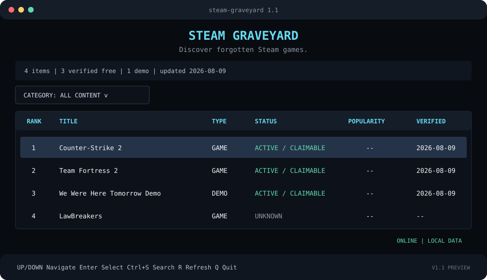

<div align="center">

```text
  _________ __                         ________                              .___
 /   _____//  |_  ____ _____    _____ /  _____/___________ ___  _______  ___| _/
 \_____  \\   __\/ __ \\__  \  /     /   \  __\_  __ \__  \\ \_  __ \/ __ |
 /        \|  | \  ___/ / __ \|  Y Y \    \_\  \  | \// __ \_|  | \/ /_/ |
/_______  /|__|  \___  >____  /__|_|  /\______  /__|  (____  /|__|  \____ |
        \/           \/     \/      \/        \/           \/            \/
```

# SteamGraveyard

**Discover forgotten Steam games.**

A fast, local-first terminal catalog for researching delisted Steam games,
tracking catalog changes, and opening only verified Steam-supported actions.

[](https://github.com/tugrakaymakcioglu/SteamGraveyard/actions/workflows/tests.yml)
[](https://www.python.org/)
[](LICENSE)
[](https://textual.textualize.io/)

</div>

---

Games disappear from storefronts. Their histories should not disappear with them.

SteamGraveyard turns a versioned SQLite dataset into a responsive terminal catalog. It helps
researchers, preservation-minded players, and curious developers inspect catalog history without
collecting Steam credentials or pretending that an AppID grants ownership. The application is
useful offline, keeps provenance beside verification claims, and delegates every license decision
to the official Steam client.

> [!IMPORTANT]
> SteamGraveyard does **not** bypass Steam ownership, licensing, DRM, or payment systems. It only
> opens Steam-supported URI actions. Steam decides whether a license or installation is available
> for an account. AppIDs and package/SubIDs do not grant ownership.



## Why SteamGraveyard

- **Fast terminal workflow** — browse a paged Textual table designed for large local datasets.
- **Search that forgives typos** — find games by title, AppID, or aliases with FTS5 and RapidFuzz.
- **Evidence before labels** — unverified claimability remains `UNKNOWN`; stale checks are visible.
- **Conservative change detection** — one missing scan is suspicion, not proof of delisting.
- **Safe Steam handoff** — supported `steam://` URIs are opened through the operating system.
- **Offline by design** — the catalog, search, details, and exports work without a network.
- **Automation-ready data** — consume deterministic JSON, CSV, JSONL, or the SQLite database.

## Install

### From GitHub

```bash
python -m pip install "git+https://github.com/tugrakaymakcioglu/SteamGraveyard.git"
steam-graveyard
```

Python 3.12 or newer is required. The application creates its local database on first launch and
imports the bundled conservative seed, so an API key is **not** required for browsing.

### Developer checkout

```bash
git clone https://github.com/tugrakaymakcioglu/SteamGraveyard.git
cd SteamGraveyard
python -m venv .venv
```

Activate the environment:

```powershell
# Windows PowerShell
.\.venv\Scripts\Activate.ps1
python -m pip install -e ".[dev]"
```

```bash
# Linux / macOS
source .venv/bin/activate
python -m pip install -e ".[dev]"
```

## Quick start

```bash
# Open the terminal UI
steam-graveyard

# Search without opening the TUI
steam-graveyard search "lawbreakers"

# Inspect a known AppID
steam-graveyard game 350280

# Export the current local database
steam-graveyard export
```

### Keyboard controls

| Key | Action |
| --- | --- |
| `↑` / `↓` | Move through games and load adjacent result pages |
| `Ctrl+S` | Open live search |
| `Enter` | Open the selected game or send a verified action to Steam |
| `C` | Copy the verified Steam URI on the detail screen |
| `R` | Refresh the catalog using `STEAM_API_KEY` |
| `Esc` | Close search or return to the catalog |
| `Q` | Quit |

## CLI reference

```text
steam-graveyard                         Open the TUI
steam-graveyard search QUERY [--limit] Search names, AppIDs, and aliases
steam-graveyard game APPID             Show one local record
steam-graveyard latest [--limit]       Show recent catalog events
steam-graveyard claimable [--limit]    List source-verified claimable games
steam-graveyard delisted [--limit]     List confirmed delisted games
steam-graveyard update                 Run a complete Steam catalog scan
steam-graveyard export                 Rebuild JSON, CSV, and JSONL exports
```

Use `--data-dir PATH` before a command to isolate a dataset. Configuration can also be supplied
through the environment variables documented in [`.env.example`](.env.example).

## How it works

```text
Official Steam catalog API
          │ complete, paginated scan
          ▼
Validated gzip snapshot ──► snapshot safety guard
          │
          ▼
SQLite transaction ──► events + missing-scan state ──► deterministic exports
          │
          ├──► Textual TUI / fuzzy search
          └──► Rich CLI
```

Catalog updates use Valve's supported, paginated
[`IStoreService/GetAppList/v1`](https://partner.steamgames.com/doc/webapi/IStoreService)
interface. The deprecated `ISteamApps/GetAppList/v2` endpoint is not used. A full scan requires a
Steam Web API key:

```bash
cp .env.example .env
# Set STEAM_API_KEY in .env, then:
steam-graveyard update
```

On Windows PowerShell, use `Copy-Item .env.example .env`. Steam Web API keys are managed through
Valve's [Web API key page](https://steamcommunity.com/dev/apikey).

Secrets are never committed, printed, or written to structured logs.

### Delisting detection

A disappeared AppID is not immediately classified as delisted. Only successful, complete scans
advance the state machine:

```text
ACTIVE → SUSPECTED_DELISTING → DELISTED
                              ↘ RELISTED when the AppID returns
```

The default confirmation threshold is three consecutive complete scans. Failed and partial scans
do not change missing counters. A snapshot smaller than 80% of the preceding successful snapshot
is rejected to reduce the risk of mass false positives.

### Claimability and Steam URIs

Catalog presence, an AppID, or a working URI says nothing about license availability.
SteamGraveyard therefore separates catalog status from claim status:

- `CLAIMABLE` — a maintained source confirms that Steam currently offers the license.
- `OWNERS_ONLY` — existing owners may be able to install it; Steam still verifies ownership.
- `UNKNOWN` — no sufficiently current evidence exists.
- `UNAVAILABLE` — a maintained source confirms that no supported activation is available.

Only `CLAIMABLE` and `OWNERS_ONLY` records with validated activation metadata expose an action:

```text
steam://install/<appid>
steam://subscriptioninstall/<subid>
```

SteamGraveyard does not log in to Steam, inspect an account, forge a license, download protected
depots, or alter the Steam client. Claimability data must be curated separately from catalog scans.

Maintainers can validate and import a reviewable JSON batch with
`python scripts/import_verifications.py records.json`. Each record must include the AppID, exact
claim status, UTC verification time, method, original source object, and any activation metadata.
The importer applies the same safety validation as the application and rebuilds the public exports.

### Popularity score

Popularity is deterministic and normalized to `0–100`:

| Component | Weight | Normalization |
| --- | ---: | --- |
| Historical peak players | 50% | `log1p(value) / log1p(1,000,000)` |
| Review count | 30% | `log1p(value) / log1p(1,000,000)` |
| Review score | 20% | `score / 100` |

Missing components are not invented. Available weights are re-normalized; when every component is
missing, the score remains `null` and the UI displays `—`.

## Data and provenance

Runtime state is stored in `data/steam_graveyard.db` for a source checkout. The binary database,
logs, and raw snapshots are intentionally ignored by Git. Stable public exports live in:

- `data/export/games.json`
- `data/export/games.csv`
- `data/export/events.jsonl`

Core tables are `games`, `events`, `sources`, `verification_history`, and `scan_runs`. All exported
timestamps are ISO 8601 UTC and every format carries `schema_version: 1`.

The bundled V1 seed is deliberately small. It identifies LawBreakers from an
[official Steam announcement](https://store.steampowered.com/news/?appgroupname=LawBreakers&appids=350280&feed=steam_community_announcements),
but keeps both delisting and claimability conservative where the available evidence does not prove
their current state. SteamGraveyard never upgrades historical context into a current claimability
claim.

## Reliability and failure behavior

- Missing network: the TUI shows `OFFLINE MODE`; local features remain available.
- Missing API key: browsing works; `update` exits with a concise configuration message.
- Rate limits and transient server errors: bounded retry honors `Retry-After`.
- Missing Steam handler: no shell fallback or unsafe command construction is attempted.
- Corrupt database: the file is preserved and recovery guidance is shown; it is never silently
  deleted.
- Clipboard failure: the TUI remains open and reports the failure.

## Development

```bash
ruff check .
ruff format --check .
mypy steam_graveyard scripts
pytest
python -m build
```

Tests use mock transports, temporary SQLite databases, and Textual's headless pilot. They never
open a real Steam client. Pull requests run the same gates on Linux and Python 3.12.

The scheduled catalog workflow reads `STEAM_API_KEY` from GitHub Actions secrets. With no key it
exits successfully with an explicit skip summary. Dataset commits are opt-in through the repository
variable `STEAM_GRAVEYARD_AUTO_COMMIT=true`.

See [CONTRIBUTING.md](CONTRIBUTING.md) before proposing dataset or code changes. Security reports
belong in the private process described by [SECURITY.md](SECURITY.md), not in public issues.

## Roadmap

- **V1:** TUI, search, SQLite dataset, safe Steam URI launcher, snapshot diff, claim status, exports
- **V1.1:** richer popularity sources, filters, sorting, favorites
- **V2:** optional remote API, web dashboard, notifications, historical catalog analysis

Authenticated Steam features are explicitly outside V1. They would require a separate security and
privacy review before any future design work.

## License and trademark notice

SteamGraveyard is available under the [MIT License](LICENSE).

Steam and the Steam logo are trademarks and/or registered trademarks of Valve Corporation. This
project is independent, is not endorsed by Valve, and does not include Valve assets.
