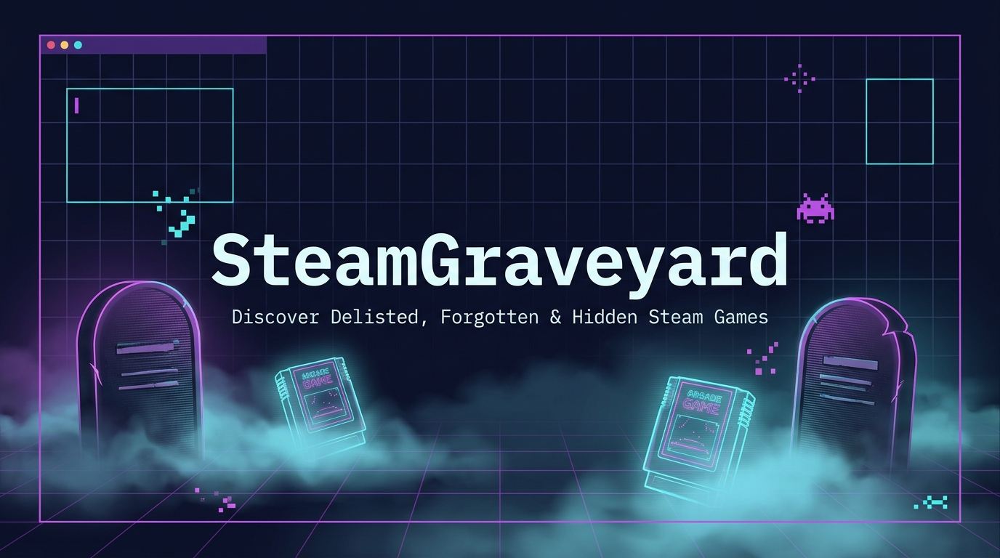
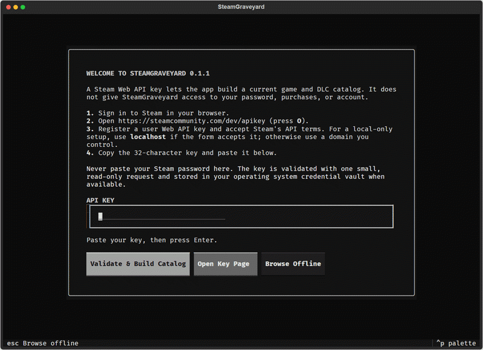

<div align="center">



# ⚰️ SteamGraveyard (Türkçe)

### Satıştan Kaldırılan, Unutulmuş Steam Oyunlarını, Gizli Demo ve DLC'leri Keşfedin

[](https://github.com/tugrakaymakcioglu/SteamGraveyard/actions/workflows/tests.yml)
[](CHANGELOG.md)
[](https://www.python.org/)
[](LICENSE)
[](https://textual.textualize.io/)
[](https://steamdb.info/)
[-informational?style=flat-square)](#windows-için-en-kolay-yol)

[English README](README.md) &nbsp;·&nbsp; [Windows Kurulumu](#windows-için-en-kolay-yol) &nbsp;·&nbsp; [Kurulum](#kurulum) &nbsp;·&nbsp; [Hızlı Başlangıç](#hızlı-başlangıç) &nbsp;·&nbsp; [Klavye Kısayolları](#klavye-kısayolları)

</div>

---

Oyunlar mağazalardan kaybolabilir; ancak tarihleri onlarla birlikte kaybolmamalıdır.

SteamGraveyard, yerel bir SQLite veritabanını akıcı ve hızlı bir terminal arayüzüne (TUI) dönüştürür. Araştırmacılar, retro oyun tutkunları ve koleksiyoncular için satıştan kaldırılmış (delisted) Steam oyunlarını, demo paketlerini ve DLC'leri güvenle inceleme imkanı sunar.

> [!IMPORTANT]
> SteamGraveyard, Steam sahiplik, lisans, DRM veya ödeme sistemlerini **asla atlatmaz**. Yalnızca resmi Steam istemcisinin desteklediği `steam://` bağlantılarını açar.

---

## 📸 Ekran Görüntüleri & Tur

<p align="center">
  
</p>

---

## 🚀 Kurulum

### Windows İçin En Kolay Yol
1. [En son Windows ZIP paketini indirin](https://github.com/tugrakaymakcioglu/SteamGraveyard/releases/latest/download/SteamGraveyard-Windows.zip).
2. ZIP'i bir klasöre çıkartın.
3. `START_STEAM_GRAVEYARD.bat` dosyasına çift tıklayın.

### GitHub Üzerinden Kurulum
```bash
python -m pip install "git+https://github.com/tugrakaymakcioglu/SteamGraveyard.git@v0.1.1"
steam-graveyard
```

---

## ⚡ Hızlı Başlangıç

```bash
# Terminal arayüzünü açın
steam-graveyard

# TUI açmadan doğrudan arama yapın
steam-graveyard search "lawbreakers"

# Bilinen bir AppID'yi inceleyin
steam-graveyard game 350280

# Yerel veritabanını dışa aktarın (JSON / CSV / SQLite)
steam-graveyard export
```

### ⌨️ Klavye Kısayolları

| Tuş | Eylem |
| --- | --- |
| `↑` / `↓` | Oyunlar arasında gezin |
| `Ctrl+S` | Canlı aramayı aç |
| `Enter` | Seçili oyunu aç veya Steam'e resmi komut gönder |
| `C` | Doğrulanmış Steam URI adresini panoya kopyala |
| `D` | SteamDB sayfasını tarayıcıda aç |
| `S` | Resmi Steam Mağaza sayfasını aç |
| `Esc` | Arama veya detaydan ana kataloğa dön |
| `Q` | Çıkış |

---

## 📄 Lisans

MIT Lisansı. Detaylar için [LICENSE](LICENSE) dosyasına bakın.
